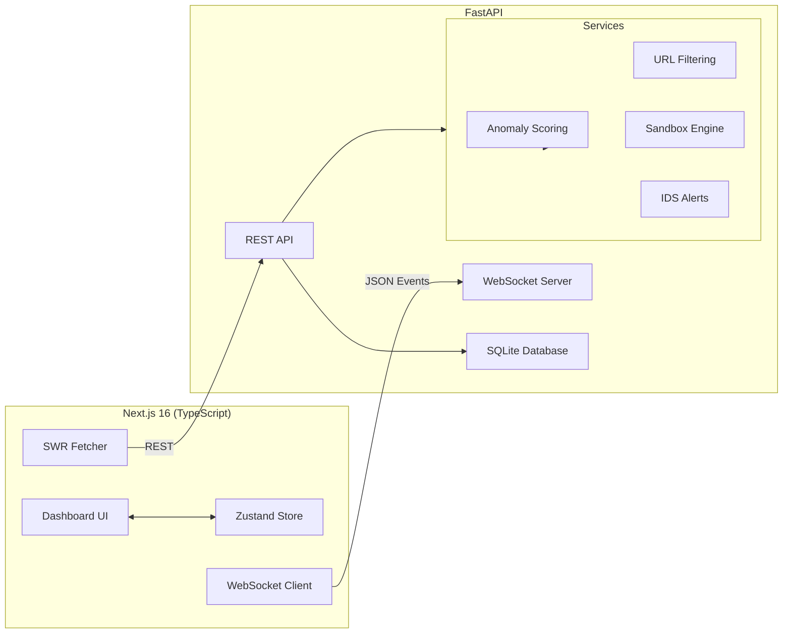

# AI Shield

A real-time antivirus dashboard combining ML-based threat detection, URL filtering, network monitoring, and sandbox analysis. Built with Next.js 16 and FastAPI.

## Overview

AI Shield provides a comprehensive security monitoring interface with:

- **Real-time threat detection** via ML anomaly scoring and Snort IDS integration
- **URL filtering** with WebShield risk assessment and blocking
- **Network monitoring** with active connection tracking and IP blocking
- **Sandbox analysis** for file behavior simulation and verdict generation
- **File scanning** with manual upload and background live scanning
- **System metrics** with CPU, memory, disk, and network visualization
- **Activity logs** for audit trail and event history

## Architecture



## Project Structure

```
AI_Shield/
├── backend/
│   ├── app/
│   │   ├── main.py              # FastAPI app, routes, WebSocket
│   │   ├── store.py             # SQLModel database models
│   │   └── services/
│   │       ├── anomaly.py       # ML threat scoring
│   │       ├── webshield.py     # URL risk evaluation
│   │       ├── sandbox.py       # Behavior analysis
│   │       └── snort.py         # IDS alert reader
│   ├── run.py                   # Uvicorn server launcher
│   ├── requirements.txt
│   └── ai_shield.db             # SQLite database
│
└── frontend/
    ├── src/
    │   ├── app/
    │   │   ├── layout.tsx        # Global layout
    │   │   └── page.tsx          # Dashboard
    │   ├── components/
    │   │   └── RealtimeStatus.tsx # Connection indicator
    │   ├── features/             # Dashboard panels
    │   │   ├── overview/
    │   │   ├── gauge/
    │   │   ├── resources/
    │   │   ├── threats/
    │   │   ├── management/
    │   │   ├── network/
    │   │   ├── webshield/
    │   │   ├── sandbox/
    │   │   ├── scanner/
    │   │   └── logs/
    │   ├── lib/
    │   │   ├── api.ts            # Axios HTTP client
    │   │   └── ws.ts             # WebSocket handler
    │   └── store/
    │       └── app-store.ts      # Zustand state management
    ├── next.config.ts
    └── package.json
```

## Quick Start

👉 **New to AI Shield?** Start here: [QUICK-START.md](QUICK-START.md) - Simple step-by-step guide for beginners!

## Installation

### Prerequisites

- **Python 3.8 or higher** (Python 3.10+ recommended)
- **Node.js 18 or higher**
- **npm** (comes with Node.js) or **yarn**

> **Note:** Commands below work on Windows (PowerShell/CMD), Linux, and macOS. Use the command that matches your terminal.

### Backend Setup

**Step 1: Navigate to backend directory**
```bash
cd backend
```
*(Windows PowerShell/CMD, Linux, macOS - same command)*

**Step 2: Create virtual environment**

**Windows (PowerShell):**
```powershell
python -m venv venv
venv\Scripts\Activate.ps1
```

**Windows (CMD):**
```cmd
python -m venv venv
venv\Scripts\activate.bat
```

**Linux/macOS:**
```bash
python3 -m venv venv
source venv/bin/activate
```

**Step 3: Upgrade pip (recommended)**
```bash
python -m pip install --upgrade pip
```
*(Works on all platforms)*

**Step 4: Install Python dependencies**
```bash
pip install -r requirements.txt
```
*(Works on all platforms - virtual environment must be activated)*

> **Tip:** If `python` doesn't work, try `python3` (common on Linux/macOS). If activation fails on Windows PowerShell, run: `Set-ExecutionPolicy -ExecutionPolicy RemoteSigned -Scope CurrentUser`

### Frontend Setup

**Step 1: Navigate to frontend directory** (in a new terminal)
```bash
cd frontend
```

**Step 2: Install Node.js dependencies**
```bash
npm install
```
*(Works on all platforms - Windows, Linux, macOS)*

## Running the Project

### Start Backend

**Activate virtual environment first** (if not already activated):

**Windows (PowerShell):**
```powershell
cd backend
venv\Scripts\Activate.ps1
python run.py
```

**Windows (CMD):**
```cmd
cd backend
venv\Scripts\activate.bat
python run.py
```

**Linux/macOS:**
```bash
cd backend
source venv/bin/activate
python run.py
```

Backend runs on `http://127.0.0.1:8001` or `http://localhost:8001`

### Start Frontend

Open a **new terminal window** and run:

```bash
cd frontend
npm run dev
```
*(Works on all platforms - Windows, Linux, macOS)*

Frontend runs on `http://localhost:3000`

### Access Dashboard

Open your web browser and navigate to: **`http://localhost:3000`**

The dashboard will automatically connect to the backend API.

## Configuration

Environment variables (optional):

- `FRONTEND_ORIGIN`: Frontend URL for CORS (default: `http://localhost:3000`)
- `NEXT_PUBLIC_API_BASE`: Backend API URL (default: `http://127.0.0.1:8001`)
- `NEXT_PUBLIC_WS_URL`: WebSocket URL (default: `ws://127.0.0.1:8001/ws`)

## Features

### Dashboard Overview

- Active threat count and severity distribution
- System health metrics (CPU, memory, disk usage)
- Network activity monitoring
- Real-time status indicator

### Threat Feed

- Live threat events with severity levels
- Per-threat actions (quarantine, delete, allow)
- Threat source attribution (ML, Snort, WebShield, Sandbox)

### Threat Management Center

- Filterable threat list by severity and source
- Bulk actions on multiple threats
- Detailed threat inspection
- Action history

### WebShield URL Filtering

- URL risk scoring and categorization
- Manual URL blocking
- Blocked URL list management
- Real-time alert feed

### Network Monitor

- Active connection tracking
- Process and remote IP identification
- IP blocking capability
- Network alert history

### Sandbox Analysis

- File behavior simulation
- Job progress tracking
- Verdict generation (benign, suspicious, malicious)
- System call analysis

### File Scanners

- **Manual Scanner**: Upload files for immediate analysis
- **Background Scanner**: Configure paths for continuous monitoring
- Scan history with results
- ML risk scoring and file metadata

### Activity Logs

- Event audit trail
- Severity-based filtering
- Log export capability

### System Charts

- Real-time CPU, memory, disk usage
- Network throughput (upload/download)
- Adaptive styling based on thresholds

## API Endpoints

Base URL: `http://localhost:8001`

### Overview & Threats

- `GET /api/overview` — System overview metrics
- `GET /api/threats` — List threats (query: `limit`, `severity`, `source`, `action`)
- `GET /api/threats/{id}` — Threat details
- `POST /api/threats` — Create threat
- `POST /api/threats/bulk-action` — Bulk threat actions

### File Scanning

- `POST /api/scan/file` — Scan uploaded or local file
- `GET /api/scan/history` — Scan history
- `DELETE /api/scan/history/{id}` — Delete scan record
- `DELETE /api/scan/history` — Clear all history

### Background Scanner

- `GET /api/scan/live/status` — Scanner status and paths
- `POST /api/scan/live/toggle` — Enable/disable scanner
- `POST /api/scan/live/add-path` — Add scan path
- `DELETE /api/scan/live/remove-path` — Remove scan path

### URL Scanning

- `POST /api/scan/url` — Classify URL risk
- `GET /api/webshield/blocked` — Blocked URLs list

### Network

- `GET /api/network/connections` — Active connections
- `POST /api/network/block` — Block IP address
- `GET /api/network/webshield/alerts` — WebShield alerts
- `POST /api/network/webshield/block` — Block URL
- `POST /api/network/webshield/toggle` — Enable/disable WebShield

### Sandbox

- `GET /api/sandbox/jobs` — List sandbox jobs
- `POST /api/sandbox/run` — Start sandbox job
- `GET /api/sandbox/{job_id}` — Job details

### Logs & Health

- `GET /api/logs` — Activity logs
- `GET /api/logs/download` — Export logs
- `GET /api/snort/alerts` — Snort IDS alerts
- `GET /healthz` — Health check

## WebSocket Events

Endpoint: `ws://localhost:8001/ws`

### Emitted Events

| Event               | Data                                           | Purpose               |
| ------------------- | ---------------------------------------------- | --------------------- |
| `metric`            | `{t, cpu, mem, disk, netUp, netDown}`          | System metrics        |
| `threat`            | `{...Threat}`                                  | New threat detected   |
| `threatLevel`       | `number`                                       | Overall threat level  |
| `threat_updated`    | `{...Threat}`                                  | Threat status changed |
| `connection_update` | `{pid, process, remote, bytes_sec, timestamp}` | Network activity      |
| `snort_alert`       | `{sid, msg, src, dst, time}`                   | IDS alert             |
| `webshield_alert`   | `{url, score, category, action, timestamp}`    | URL blocked           |
| `scan_status`       | `{enabled, paths, timestamp}`                  | Scanner status        |
| `scan_event`        | `{job_id, percent, scanned, timestamp}`        | Scan progress         |
| `sandbox_progress`  | `{job_id, percent, timestamp}`                 | Job progress          |
| `sandbox_result`    | `{job_id, verdict, calls, score, timestamp}`   | Job complete          |
| `log`               | `{level, msg, timestamp}`                      | Activity log          |

## Threat Detection Pipeline

1. **File Scan Trigger**: Manual upload or background scanner detects file
2. **ML Scoring**: `services/anomaly.score_path()` computes risk score
3. **Sandbox Analysis**: `services/sandbox.analyze_path()` simulates behavior
4. **Threat Creation**: Results stored and broadcast via WebSocket
5. **User Action**: Dashboard displays threat for review and action

## Tech Stack

**Frontend:**

- Next.js 16 (React 19)
- TypeScript
- Zustand (state management)
- SWR (data fetching)
- Tailwind CSS + ShadCN UI
- Recharts (visualizations)
- Lucide React (icons)

**Backend:**

- FastAPI
- Pydantic
- SQLModel (ORM)
- SQLite
- Uvicorn
- WebSockets

## Development Notes

- ML anomaly scoring is currently stubbed with heuristics; replace with trained model for production
- Snort integration reads from common alert file locations; wire to live Snort instance for production
- Sandbox is simulated; integrate with real sandbox tool (Cuckoo, etc.) for production
- Database persists to `ai_shield.db` in backend directory

## Future Enhancements

- Production ML model integration
- Live Snort IDS ingestion
- Real sandbox runner integration
- Authentication and RBAC
- Advanced filtering and pagination
- Filesystem event monitoring
- System service packaging
